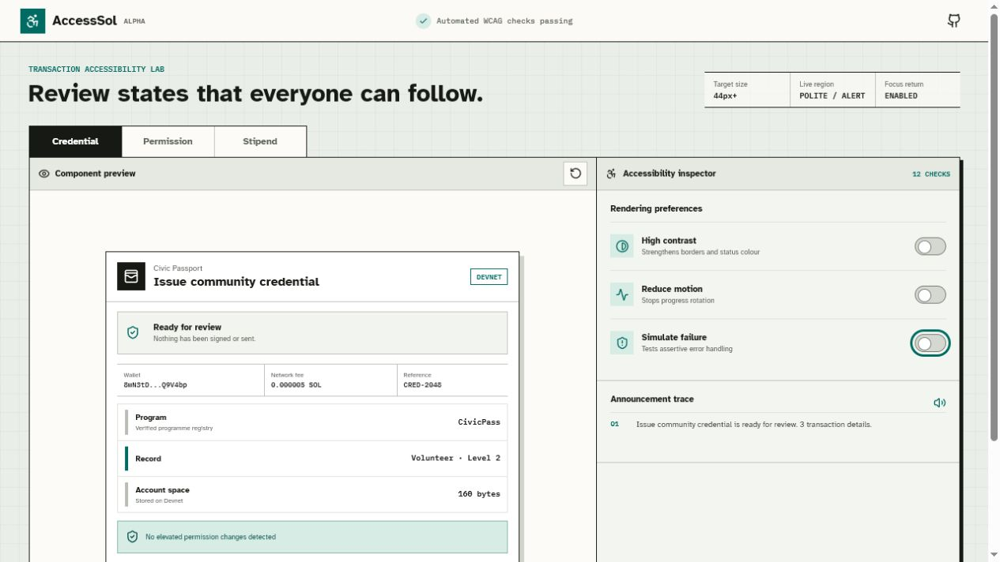

# AccessSol

AccessSol is an open-source React SDK for transaction review and transaction-status experiences that remain understandable with a keyboard, a screen reader, reduced motion, or high-contrast rendering.



The first release focuses on the part of a Solana flow where mistakes are expensive: the handoff between a dApp's proposed action, the wallet prompt, network submission, and final confirmation.

## SDK surface

- `AccessibleTransactionReview`: semantic review, warnings, named controls, minimum target sizes, and explicit status states.
- `useTransactionAnnouncer`: polite progress updates, assertive failure messages, and focus restoration when a transaction finishes.
- `announcementFor`: deterministic text that can be logged and tested independently of rendering.
- Portable transaction-review model for wallet-adapter integrations.

## Local development

```bash
npm install
npm run dev
npm run check
npm test
npm run build
```

## Example

```tsx
import { AccessibleTransactionReview } from '@accesssol/react'
import '@accesssol/react/styles.css'

<AccessibleTransactionReview
  transaction={reviewModel}
  status="review"
  onConfirm={requestWalletSignature}
  onReject={closeReview}
/>
```

The component does not sign transactions, hold keys, or replace wallet security prompts. It presents a structured review before a wallet request and communicates the resulting state after the wallet responds.

## Verification

The test suite runs `axe-core` against rendered transaction review states and separately checks action names, focus movement, warning alerts, and deterministic announcements. Automated checks are a baseline, not a substitute for testing with disabled users and assistive technologies; funded milestones explicitly include moderated validation and an independent accessibility review.

## Roadmap

- Wallet Adapter reference integration and transaction-to-review adapters.
- Token, account creation, programme permission, and multi-instruction summaries.
- VoiceOver, NVDA, JAWS, and keyboard-only test matrix.
- Localised announcements and right-to-left layout.
- Public conformance notes mapped to WCAG 2.2 success criteria.

## License

MIT. See [LICENSE](LICENSE).
